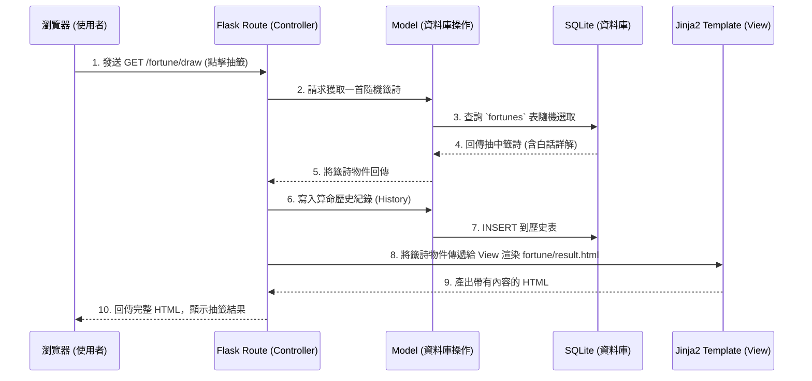

# 系統架構設計文件 (ARCHITECTURE)

本文件基於 `docs/PRD.md` 的需求，規劃「線上算命系統」的相關系統架構、專案結構與元件職責。

## 1. 技術架構說明

本系統採用的核心技術與原因如下：

*   **後端框架：Python + Flask**
    *   **原因**：Flask 是輕量級且高彈性的 Python Web 框架，非常適合快速開發與中小型專案。它能輕鬆處理路由、HTTP 請求以及與各類函式庫整合。
*   **視圖與渲染層：Jinja2 (Flask 內建)**
    *   **原因**：系統無須採前後端分離，直接透過 Jinja2 在後端渲染 HTML 畫面，並傳遞變數給前端（例如：抽出的籤詩、使用者名稱、歷史紀錄），減少繁雜的 API 開發需求，加速 MVP 產品上線。
*   **資料庫：SQLite**
    *   **原因**：輕量級本地資料庫，適合現階段開發、測試與小型部署，無需額外建立獨立伺服器。可用來存放「籤詩庫」、「使用者帳號」與「算命歷史紀錄」。
*   **前端介面：HTML, CSS (Vanilla CSS), JavaScript**
    *   **原因**：以原生技術製作，透過 JavaScript 實作抽籤與擲筊的互動效果，不引入過重的前端框架。

### MVC 設計模式 (Model / View / Controller) 於本專案之應用

為保持程式碼的清晰好維護，我們將採用 Flask 搭配 MVC 的概念進行職責分離：
*   **Model (資料層)**：封裝與 SQLite 溝通的邏輯。負責「新增會員」、「查詢歷史紀錄」、「隨機抽出籤詩」等核心資料操作。
*   **View (視圖層)**：對應 `templates/` 目錄下的 Jinja2 HTML 檔案。負責將資料（例如籤詩結果內容）以美觀的介面顯示在瀏覽器。
*   **Controller (控制層)**：對應 Flask 的 Routes。接收瀏覽器的請求，呼叫對應的 Model 取得資料庫內容，然後把資料交給 View (Jinja2) 渲染後回傳給瀏覽器。

---

## 2. 專案資料夾結構

本專案採模組化規劃，方便日後擴充。完整的資料夾樹狀圖與職責簡述如下：

```text
web_app_development/
├── docs/                   ← 專案文件 (包含 PRD, ARCHITECTURE 等)
├── app/                    ← Flask 主應用程式目錄
│   ├── __init__.py         ← 初始化 Flask APP 與設定
│   ├── models/             ← 資料庫模型與操作邏輯 (Model)
│   │   ├── __init__.py
│   │   ├── user.py         ← 處理註冊、密碼驗證、取得會員資料
│   │   ├── fortune.py      ← 處理籤詩庫、隨機抽籤邏輯
│   │   └── history.py      ← 處理算命紀錄與捐款紀錄讀寫
│   ├── routes/             ← Flask 路由控制器 (Controller)
│   │   ├── __init__.py
│   │   ├── main.py         ← 首頁、關於等主要頁面路由
│   │   ├── auth.py         ← 處理登入、註冊路由
│   │   ├── fortune.py      ← 處理抽籤、解籤等 API / 頁面路徑
│   │   └── donate.py       ← 處理香油錢模擬捐款邏輯
│   ├── templates/          ← Jinja2 HTML 模板檔案 (View)
│   │   ├── base.html       ← 全站共用的佈局模板 (包含 Header, Footer)
│   │   ├── index.html      ← 網站首頁
│   │   ├── auth/           ← 登入、註冊表單頁面
│   │   ├── fortune/        ← 抽籤畫面與解籤結果頁面
│   │   ├── profile/        ← 個人歷史紀錄頁面
│   │   └── donate/         ← 捐香油錢頁面
│   └── static/             ← 靜態資源檔案
│       ├── css/            
│       │   └── style.css   ← 全站樣式檔
│       ├── js/             
│       │   └── main.js     ← 抽籤動畫、防連點等互動邏輯
│       └── images/         ← 網站圖片、籤筒/筊杯素材圖
├── instance/               ← 用於存放敏感資料與本地端檔案
│   └── database.db         ← SQLite 本地端資料庫檔案
├── data/                   ← 初始資料匯入 (例如籤詩文本 csv 等)
├── requirements.txt        ← Python 套件相依性清單
└── app.py                  ← 專案進入點 (執行 python app.py 啟動伺服器)
```

---

## 3. 元件關係圖

以下展示使用者在瀏覽器操作抽籤功能時的系統運作流程：



---

## 4. 關鍵設計決策

以下列出本專案在技術與架構上的重要決策及其原因：

1.  **不採取前後端分離與 SPA (Single Page Application)**
    *   **原因**：線上算命專案的介面通常為「展示型頁面」或「表單頁面」。使用 Flask + Jinja2 傳統渲染架構能大幅降低初期開發複雜度，對於 SEO 也有著先天的優勢，有助於未來使用者在 Google 上搜尋算命文章與籤詩解盤。
2.  **分散路由架構 (Blueprint / Modules)**
    *   **原因**：將 `routes` 分為 `auth`, `main`, `fortune`, `donate`。這樣能避免把所有程式碼塞入同一支檔案中，日後若「香油錢」或「抽籤」邏輯變複雜，可獨立管理，適合多人分工。
3.  **將 SQLite 放置於 `instance/` 資料夾**
    *   **原因**：`instance/` 可以被輕易放入 `.gitignore`。這樣可確保資料庫不會被意外推送到公開儲存庫，保護會員資料安全。
4.  **前端互動交由 Vanilla JavaScript**
    *   **原因**：針對抽籤、搖籤筒或擲筊等單一點擊互動體驗，只需要簡單的 DOM 操作與 CSS 動畫，因此不引入 Vue 或是 React，能確保網頁載入速度達到最快。
5.  **透過 Model 封裝資料庫查詢**
    *   **原因**：雖然開發上可以把 SQL 查詢寫在 Controller，但我們定義了 `app/models/` 目錄。將所有的資料庫操作都收斂至此，如果日後決定升級 PostgreSQL 或是整合 SQLAlchemy，僅需修改 Model 層，Controller 完全不需要變動。
