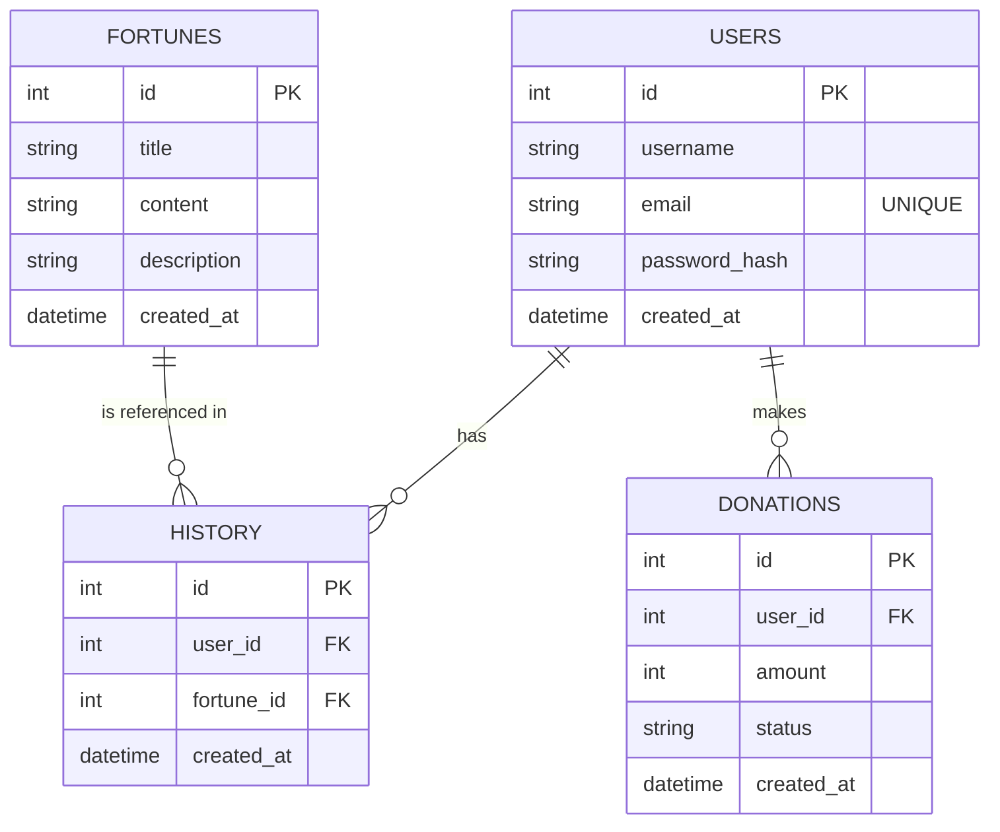

# 資料庫設計文件 (DB DESIGN)

本文件依據 PRD、FLOWCHART 與 ARCHITECTURE 規劃「線上算命系統」的資料庫結構。採用 SQLite 作為資料庫管理系統。

## 1. ER 圖 (實體關係圖)

---

## 2. 資料表詳細說明

### 2.1 USERS (使用者表)
儲存使用者的基本帳戶資訊。
- `id`: INTEGER PRIMARY KEY AUTOINCREMENT，使用者唯一識別碼。
- `username`: TEXT NOT NULL，使用者名稱。
- `email`: TEXT NOT NULL UNIQUE，使用者信箱，用於登入，必須唯一。
- `password_hash`: TEXT NOT NULL，經湊雜處理過的使用者密碼。
- `created_at`: TEXT NOT NULL，帳號建立時間（ISO 8601 文字格式）。

### 2.2 FORTUNES (籤詩表)
儲存神明籤詩的靜態資料庫。
- `id`: INTEGER PRIMARY KEY AUTOINCREMENT，籤詩唯一識別碼（如第幾籤）。
- `title`: TEXT NOT NULL，籤詩標題（例：「第一籤」）。
- `content`: TEXT NOT NULL，籤詩詩句原文內容。
- `description`: TEXT NOT NULL，籤意白話文詳解。
- `created_at`: TEXT NOT NULL，資料建立時間。

### 2.3 HISTORY (算命紀錄表)
紀錄使用者每一次抽籤的結果，關聯使用者與籤詩。
- `id`: INTEGER PRIMARY KEY AUTOINCREMENT，紀錄唯一識別碼。
- `user_id`: INTEGER NOT NULL，外來鍵，關聯 `USERS.id`。
- `fortune_id`: INTEGER NOT NULL，外來鍵，關聯 `FORTUNES.id`。
- `created_at`: TEXT NOT NULL，抽籤當下之時間。

### 2.4 DONATIONS (香油錢捐獻紀錄表)
紀錄使用者在線上的捐獻紀錄與狀態。
- `id`: INTEGER PRIMARY KEY AUTOINCREMENT，捐款紀錄唯一識別碼。
- `user_id`: INTEGER NOT NULL，外來鍵，關聯 `USERS.id`（可為 NULL，若允許訪客捐款，但依目前架構建議綁定會員以供查詢）。
- `amount`: INTEGER NOT NULL，捐獻的金額 (新台幣)。
- `status`: TEXT NOT NULL，付款狀態（例：`PENDING`, `SUCCESS`, `FAILED`）。
- `created_at`: TEXT NOT NULL，捐獻建立時間。

---

## 3. SQL 建表語法與 Python 實作
我們已將建表語法儲存於 `database/schema.sql`。
並於 `app/models/` 當中實作了對應的 Python Model (`user.py`, `fortune.py`, `history.py`)，由原生的 sqlite3 套件封裝基本的 CRUD 操作。
