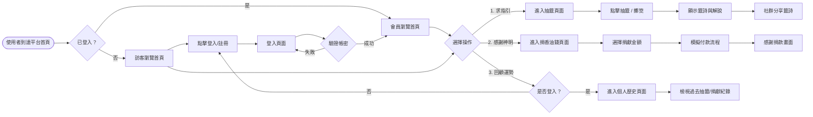
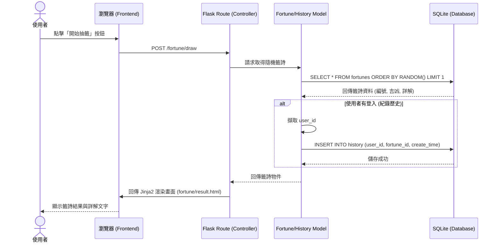

# 系統流程圖文件 (FLOWCHART)

這份文件基於 PRD 與系統架構設計，描繪出使用者的操作路徑（User Flow），以及系統內部的資料流動順序（Sequence Diagram），並列出了全站預計的路由對照表。

---

## 1. 使用者流程圖 (User Flow)

此流程圖展示了使用者進入網站後，主要的幾條操作動線，包含註冊登入、抽籤解籤、查看歷史與捐獻香油錢。

---

## 2. 系統序列圖 (Sequence Diagram)

此圖描述最核心的功能：**單次抽籤並紀錄結果** 的系統底層運作流程。涵蓋前端瀏覽器、Flask Controller、Model 到資料庫的操作。

---

## 3. 功能清單對照表

此表列出目前預計需要開發的 URL 路由、對應的 HTTP 請求方法，以及其負責的功能對應到 MVC 內的結構。

| 功能描述 | URL 路徑 | HTTP 方法 | 對應 Route 模組 | 對應 Template |
| :--- | :--- | :--- | :--- | :--- |
| **首頁** (網站介紹、入口) | `/` | GET | `main.py` | `index.html` |
| **註冊頁面/提交註冊** | `/auth/register` | GET, POST | `auth.py` | `auth/register.html` |
| **登入頁面/提交登入** | `/auth/login` | GET, POST | `auth.py` | `auth/login.html` |
| **登出** | `/auth/logout` | GET | `auth.py` | (無，重定向) |
| **進入抽籤頁面** | `/fortune/` | GET | `fortune.py` | `fortune/index.html` |
| **執行抽籤與結果顯示** | `/fortune/draw` | GET, POST | `fortune.py` | `fortune/result.html` |
| **個人歷史紀錄列表** | `/profile/` | GET | `main.py` 或 `history.py` | `profile/index.html` |
| **進入捐香油錢頁面** | `/donate/` | GET | `donate.py` | `donate/index.html` |
| **提交捐款表單** | `/donate/pay` | POST | `donate.py` | `donate/success.html` |
